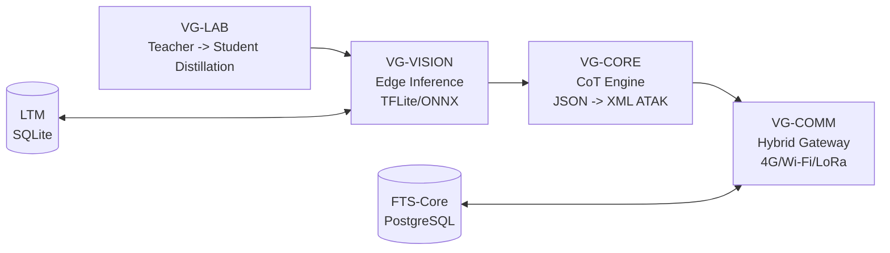

# 🛡️ VANGUARD-DEFENSE

<p align="center">
  <b>Vision, Analytics & Next-Generation Units for Reconnaissance and Defense</b><br/>
  Plataforma de consciência situacional para Edge AI + CoT/ATAK + comunicação tática híbrida.
</p>

<p align="center">
  
  
  
  
</p>

---

## 🎯 Visão Geral

O **VANGUARD** é um projeto de Iniciação Científica (UNIFEI) focado em **Ciência de Dados Aplicada à Defesa**.
O objetivo é transformar detecções de visão computacional em eventos operacionais no padrão **CoT (Cursor on Target)**,
com transmissão resiliente por múltiplos transportes (4G, Wi-Fi tático e LoRa/Meshtastic).

---

## 🧭 Navegação Rápida

- [Arquitetura de Alto Nível](#-arquitetura-de-alto-nível)
- [Módulos do Sistema](#-módulos-do-sistema)
- [Sistema de Gerência de Skills](#-sistema-de-gerência-de-skills)
- [Estrutura do Repositório](#-estrutura-do-repositório)
- [Quickstart](#-quickstart)
- [Governança Técnica](#-governança-técnica)

---

## 🏗️ Arquitetura de Alto Nível



---

## 🧩 Módulos do Sistema

| Módulo | Papel | Contrato de Interface |
|---|---|---|
| **VG-VISION** | Inferência em Edge | `Stream RGB -> List[BoundingBox] (JSON)` |
| **VG-CORE** | Conversão para padrão ATAK/CoT | `BoundingBox JSON -> XML-CoT` |
| **VG-COMM** | Entrega híbrida resiliente | `CoT -> Priority Queue -> Network` |
| **VG-LAB** | Distilação de conhecimento (Teacher/Student) | `Raw Data -> AutoLabeling -> Distilled Model` |

---

## 🧠 Sistema de Gerência de Skills

As skills seguem contrato obrigatório:

- `skills/<skill-id>/SKILL.md`
- Registro central: `vanguard/services/skill-manager/skill_manager.py`
- Validação: `vanguard/tests/test_skill_manager.py`

### Core Toolkit
`docx` • `xlsx` • `pdf` • `pdf-reading` • `pptx` • `frontend-design` • `file-reading`

### Power-User
`skill-creator` • `mcp-builder` • `web-artifacts-builder`

---

## 📦 Estrutura do Repositório

```text
VANGUARD-DEFENSE/
├─ vanguard/
│  ├─ services/
│  │  ├─ vg-vision/
│  │  ├─ vg-core/
│  │  ├─ vg-comm/
│  │  └─ skill-manager/
│  ├─ research/
│  │  └─ lab-distillation/
│  └─ tests/
├─ skills/
├─ docker-compose.yml
├─ GOVERNANCA.md
└─ CLAUDE.md
```

---

## ⚡ Quickstart

```bash
# 1) Instalar dependências
pip install -r requirements-dev.txt

# 2) Configurar variáveis locais
cp .env.example .env

# 3) Rodar testes
pytest vanguard/tests/ -v --cov=vanguard

# 4) Subir ambiente de laboratório (NVIDIA Docker)
docker-compose up vg-lab
```

Para integração CoT com FreeTAKServer:

```bash
docker-compose up freetakserver
```

---

## 🧱 Governança Técnica

- [`CLAUDE.md`](./CLAUDE.md) — Especificação Técnica Ativa (Lei do Projeto)
- [`GOVERNANCA.md`](./GOVERNANCA.md) — Arquitetura de Governança Central

Princípio-chave: **Anti-Vibe Coding (Akita Way)**.
Toda mudança arquitetural deve ser refletida na documentação antes da implementação.

---

<p align="center"><i>VANGUARD — UNIFEI — 2026</i></p>
